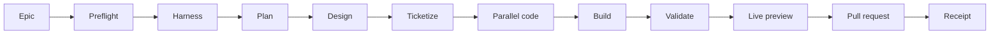
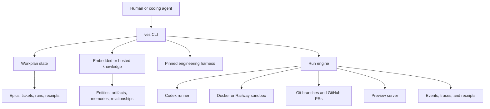
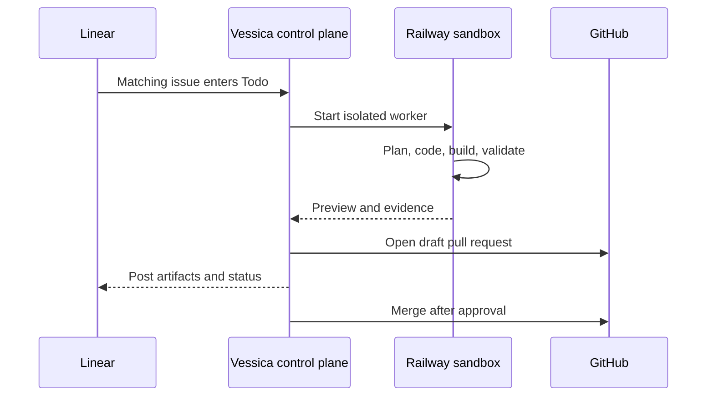

<div align="center">

# Vessica CLI

### A hosted engineering control plane for coding agents

Turn a Git repository into a durable, inspectable workflow for planning, coding, validation, previews, pull requests, and evidence.

[](https://github.com/vessica-labs/vessica-cli/actions/workflows/ci.yml)
[](https://github.com/vessica-labs/vessica-cli/releases/latest)
[](LICENSE)
[](go.mod)
[](#how-vessica-works)
[](https://github.com/vessica-labs/engineering-harness)

[Quick start](#quick-start) · [How it works](#how-vessica-works) · [Harnesses](#engineering-harnesses) · [Command map](#command-map) · [Contributing](#contributing)

</div>

> [!IMPORTANT]
> Vessica is pre-1.0 software. Command contracts, pack formats, and hosted behavior may evolve before the first stable release. Codex is the production runner in the current release.

## What is Vessica?

Coding agents are good at producing code. The harder problem is everything around the code: preserving context, turning an idea into an executable plan, coordinating parallel work, validating a coherent integration branch, giving a human something real to review, and recording what happened.

Vessica provides that operating layer through one CLI, `ves`.

| Without a harness | With Vessica |
|---|---|
| Context lives in chat history | Versioned artifacts and durable knowledge live with the workspace |
| Planning artifacts drift apart | PRDs, ADRs, designs, tests, and tickets share one run |
| Parallel agents collide | Tickets have dependencies, leases, claims, and waves |
| A final diff is the only evidence | Runs retain events, raw agent output, previews, PRs, and receipts |
| Agent prompts are fixed by a tool vendor | The engineering harness is versioned, pinned, and forkable |

Vessica orchestrates coding tools; it is not a model provider or a replacement for them. The current production execution path uses the [Codex CLI](https://github.com/openai/codex). Managed guidance is also available for Claude Code, Cursor, Pi, and MCP-oriented clients; those runners currently require simulation mode when used as execution backends.

## Quick start

This path attaches an existing Git repository to a Railway-hosted Vessica workspace, creates a missing engineering harness, then runs work with Codex.

### 1. Install `ves`

```bash
go install github.com/vessica-labs/vessica-cli/cmd/ves@latest
ves version
```

Make sure your Go bin directory is on `PATH`:

```bash
export PATH="$(go env GOPATH)/bin:$PATH"
```

### 2. Attach the repository to GitHub

Vessica needs an `origin` remote before you run an epic. It uses that remote to
clone isolated sandboxes, push branches, and create pull requests. Confirm it
first:

```bash
git remote get-url origin
```

If the command reports no `origin`, create an empty GitHub repository and attach
it before continuing:

```bash
git remote add origin git@github.com:your-org/your-repository.git
git push -u origin "$(git branch --show-current)"
```

You can use an HTTPS remote instead if that is how your GitHub credentials are
configured. Make sure the remote is reachable with `git ls-remote origin`.

### 3. Bring up hosted Vessica

```bash
cd your-repository
ves up
```

`ves up` scans the repository, shows one Railway infrastructure plan, provisions the hosted control plane and lexical knowledge service, prepares the cloud runner checkpoint, attaches the repository, and creates a repository-specific harness when one is absent. Lexical retrieval is healthy immediately and requires no embeddings API key.

Provider authentication is part of `ves up` and opens only when a valid session is unavailable. Vessica reuses Codex authentication for cloud agents and never asks for an OpenAI API key during quickstart.

### 4. Create and run an epic

```bash
cat > epic.md <<'EOF'
Add password reset using a short-lived token sent by email.

Acceptance criteria:
- A user can request a reset link.
- Tokens expire and cannot be reused.
- The flow has automated tests.
EOF

EPIC_ID=$(ves epic add \
  --title "Add password reset" \
  --body-file epic.md \
  --json | jq -r '.data.epic.id')

ves run epic "$EPIC_ID" \
  --concurrency 3 \
  --preview \
  --pr draft \
  --stream ui
```

When the preview and draft pull request look right:

```bash
ves run approve <run_id> --merge-method squash
```

### 5. Open the dashboard

```bash
ves dashboard --open
```

The dashboard is embedded in the `ves` binary and requires no separate Node.js
runtime after installation. It provides run and sandbox monitoring, live event
streams, isolated previews, review actions, knowledge search, repository
switching, workspace health, and access management.

<details>
<summary><strong>Try the workflow without calling a model</strong></summary>

Simulation mode exercises the deterministic workflow and is useful for evaluation, demos, and CI:

```bash
VES_RUNNER_MODE=stub ves run epic "$EPIC_ID" \
  --concurrency 2 \
  --preview \
  --pr draft
```

The repository also includes an end-to-end smoke test:

```bash
./scripts/launch-smoke.sh
```

</details>

## How Vessica works

Every epic follows a phase-addressable workflow. You can run the whole graph, stop after planning, or resume from a selected phase.



The pieces remain local and composable:



### Core capabilities

| Area | What Vessica provides |
|---|---|
| Workspace | Hosted Postgres authority, multi-repository discovery, attachments, diagnostics |
| Engineering harness | Agent definitions, repository docs, templates, workflow definitions, architecture lint |
| Planning | Epics transformed into PRDs, ADRs, designs, test scenarios, and dependency-aware tickets |
| Coordination | Atomic ticket claims, leases, heartbeats, blockers, readiness, and execution waves |
| Execution | Phase controls, concurrent coding workers, integration branches, resume, cancellation |
| Sandboxes | Docker execution, live previews, retained environments, direct refinement prompts |
| Observability | Human streams, interactive TUI, versioned JSONL, raw Codex logs, traces, receipts |
| Dashboard | Hosted React UI for repositories, runs, sandboxes, review, knowledge, and access |
| Integrations | GitHub authentication and PRs, best-effort Linear synchronization, Railway hosting |
| Agent ergonomics | `ves prime`, stable JSON envelopes, idempotency keys, managed runner guidance |
| Knowledge | Zero-key hosted lexical retrieval, optional user-funded semantic retrieval, immutable versions, and workflow episodes |

### Durable knowledge

`ves knowledge context` assembles active artifacts, instructions, entities, decisions, facts, and work episodes with provenance and score explanations. Responses expose the ranking version, component weights, deterministic artifact policy, per-memory scores, and artifact selection reasons. `ves entity`, `ves artifact`, and `ves memory` manage the underlying knowledge objects. `ves prime --for codex` includes the same context for coding agents.

The hosted [Vessica Knowledge Server](https://github.com/vessica-labs/vessica-knowledge-server) starts in lexical mode on Postgres without an embeddings key. Enable semantic-hybrid retrieval later with `ves knowledge embeddings enable --api-key-env OPENAI_API_KEY --yes`; the key is stored directly as a Railway secret and existing memories backfill asynchronously.

See the [Vessica Operator Guide](docs/Vessica_Operator_Guide.md) for installation, command safety, knowledge, runs, Railway operations, and troubleshooting.

## Requirements

The exact tools you need depend on the workflow you use.

| Tool | Required for | Notes |
|---|---|---|
| Go 1.25+ | Installing or building `ves` | Uses the version declared in `go.mod` |
| Git | Every workspace | The target repository should have an `origin` remote for sandbox cloning and PRs |
| Codex CLI | Production agent runs | Install and authenticate it before a non-simulated run |
| Docker | Explicit `ves dev` workflows | Not part of hosted quickstart |
| GitHub CLI (`gh`) | Browser-based GitHub login | A token can be supplied for headless use |
| Node.js 24+ and npm | Building Vessica from source or Node repositories | Installed release archives embed the compiled dashboard and require no Node runtime |
| `jq` | README shell examples | The CLI itself does not require it |
| Postgres | Hosted state and knowledge | Provisioned automatically on Railway |
| Railway CLI | Hosted control plane and sandboxes | Used by `ves up` |

Run `ves doctor` inside a workspace to see which dependencies are ready. Hosted
workspaces validate the lightweight workstation profile locally; the complete,
version-pinned worker profile is verified in the managed Railway checkpoint.

## Installation

### Release archives

Download the archive for your operating system and architecture from [GitHub Releases](https://github.com/vessica-labs/vessica-cli/releases/latest). Each release includes Linux, macOS, and Windows builds plus a `checksums.txt` file.

For example, on Apple Silicon macOS:

```bash
version=0.1.12
curl -LO "https://github.com/vessica-labs/vessica-cli/releases/download/v${version}/vessica-cli_${version}_darwin_arm64.tar.gz"
curl -LO "https://github.com/vessica-labs/vessica-cli/releases/download/v${version}/checksums.txt"
shasum -a 256 --check checksums.txt --ignore-missing
tar -xzf "vessica-cli_${version}_darwin_arm64.tar.gz"
mkdir -p ~/.local/bin
install "vessica-cli_${version}_darwin_arm64/ves" ~/.local/bin/ves
```

### Go install

```bash
go install github.com/vessica-labs/vessica-cli/cmd/ves@latest
```

### Build from source

```bash
git clone https://github.com/vessica-labs/vessica-cli.git
cd vessica-cli
go build -o bin/ves ./cmd/ves
./bin/ves version
```

To install the local build into `~/.local/bin`:

```bash
make install
```

### Container package

The hosted control-plane image is published to GitHub Container Registry for `linux/amd64` and `linux/arm64`:

```bash
docker pull ghcr.io/vessica-labs/vessica-cli:0.1.12
docker run --rm ghcr.io/vessica-labs/vessica-cli:0.1.12 version
```

Use a version tag for reproducible deployments. The `latest` tag follows the newest published release.

### Shell completion

```bash
# zsh
mkdir -p ~/.zfunc
ves completion zsh > ~/.zfunc/_ves

# bash
mkdir -p ~/.local/share/bash-completion/completions
ves completion bash > ~/.local/share/bash-completion/completions/ves

# fish
mkdir -p ~/.config/fish/completions
ves completion fish > ~/.config/fish/completions/ves.fish
```

## Workspace setup

One Vessica installation is created per Railway workspace and may contain many repositories:

```bash
ves up --dry-run --json
ves up --yes --stream jsonl

# In another repository, attach it to the same Railway workspace:
ves up
```

Local SQLite and Docker execution are developer/test utilities under `ves dev`; they are not an onboarding mode.

### Files created in a target repository

Commit the files that describe how agents should work:

```text
AGENTS.md
ARCHITECTURE.md
DESIGN.md
DEPLOY.md
TESTING.md
SECURITY.md
.vessica/
  config.yaml
  pack.lock
  pack.yaml
  harness.yaml
  agents/
  docs/
  templates/
  workflows/
  lint-arch.sh
```

`ves up` does not create repository-local databases, run logs, sandboxes, caches,
or credential directories. Hosted workflow state lives in the control plane,
hosted knowledge lives in the knowledge service, and local onboarding resume
metadata lives in `~/.vessica/client.db`. Credentials remain in the operating
system credential store (or the protected user-level fallback).

## Engineering harnesses

The default harness lives in the separate, forkable [vessica-labs/engineering-harness](https://github.com/vessica-labs/engineering-harness) repository. Vessica resolves the selected Git ref, installs the pack into `.vessica/`, and writes the exact commit SHA to `.vessica/pack.lock`.

```bash
# Install the tagged default harness
ves pack install @vessica/engineering-harness

# Restore exactly the commit in pack.lock
ves pack sync

# Refresh the configured branch or tag
ves pack update

# Install and pin a specific tag or SHA
ves pack pin v1.0.0
```

The CLI contains an embedded default snapshot for offline bootstrap. The Git repository remains the source of truth.

### Use your own harness

Fork the harness repository, edit its agent definitions and templates, then point Vessica at the fork:

```bash
ves pack pull https://github.com/your-org/engineering-harness.git#main
ves pack origin get
```

A valid harness contains:

```text
pack.yaml
harness.yaml
agents/<role>/AGENTS.md
docs/*.md
templates/*.md
workflows/*.yaml
lint-arch.sh
```

This separation is intentional: teams can upgrade Vessica without giving up control of their engineering practice.

## Running work

### Plan before coding

Generate planning artifacts and a ticket graph without entering the coding phase:

```bash
ves epic plan <epic_id>

# Equivalent phase control
ves run epic <epic_id> --stop-after ticketize
```

Inspect and approve the result:

```bash
ves artifact list --json
ves artifact view <artifact_id>
ves artifact diff <artifact_id>
ves artifact approve <artifact_id>
ves ticket list --json
ves wave list --json
```

### Run the full workflow

```bash
ves run epic <epic_id> \
  --runner codex \
  --model gpt-5.6-terra \
  --reasoning-effort high \
  --concurrency 3 \
  --preview \
  --pr draft
```

Important controls:

```bash
ves run epic <epic_id> --start-at code --reuse-artifacts approved
ves run epic <epic_id> --stop-after validate
ves run resume <run_id>
ves run resume <run_id> --from code
ves run cancel <run_id>
```

Runs use an integration branch. Ticket work is coordinated independently, merged into that branch, validated as a coherent whole, and optionally published as a pull request.

### Approve a completed run

```bash
ves run approve <run_id> --merge-method squash
```

Approval verifies the pull request head, marks a draft ready, merges it, and cleans up the integration branch and preview by default. Use `--keep-branch` or `--keep-preview` when you need to retain either one.

## Streams and logs

Vessica separates human presentation from its machine protocol.

| Mode | Best for |
|---|---|
| `pretty` | Concise non-interactive terminal output; the default |
| `ui` | Expandable, follow-mode terminal interface |
| `events` | Compact lifecycle events |
| `jsonl` | Stable `vessica.stream/v1` records for tools and agents |
| `raw` | Raw Codex JSONL |
| `off` | No live stream |

```bash
ves run epic <epic_id> --stream=pretty
ves run epic <epic_id> --stream=ui
ves run epic <epic_id> --stream=jsonl
```

Every runner invocation is persisted independently of the live mode:

```bash
ves run logs <run_id>
ves run logs <run_id> --detail <event_id>
ves run logs <run_id> --agent-output
ves run logs <run_id> --jsonl
ves run logs <run_id> --raw
ves run watch <run_id> --ui
ves run watch <run_id> --jsonl --after-seq <sequence>
```

See the [streaming protocol](docs/Vessica_stream_v1.md) for record types and resume semantics.

## Sandboxes and previews

The default local backend creates Docker sandboxes and an integration checkout. Preview-enabled runs start the detected development server during coding and keep it aligned with the integration branch.

```bash
ves run epic <epic_id> --preview
ves run epic <epic_id> --open-preview
ves run preview <run_id> --browser
```

Inspect and operate retained environments:

```bash
ves sandbox list
ves sandbox view <sandbox_id>
ves sandbox logs <sandbox_id>
ves sandbox shell <sandbox_id>
ves sandbox tunnel <sandbox_id> --browser
```

Ask Codex for a focused follow-up inside a live sandbox:

```bash
ves sandbox prompt <sandbox_id> \
  "Tighten the empty state and rerun the relevant tests"
```

Successful preview sandboxes default to 24 hours; failed runs default to four hours. Explicit retention is capped at seven days.

```bash
ves sandbox retain <sandbox_id> --for 48h
ves sandbox gc --dry-run
ves sandbox gc
ves sandbox destroy <sandbox_id> --yes
```

## Durable project coordination

Vessica exposes its state model directly so humans and standalone agents can use the same primitives as the run engine.

### Epics and artifacts

```bash
ves epic add --title "..." --body-file epic.md
ves epic list
ves epic status <epic_id>
ves artifact list
ves artifact create --type adr --title "..." --body-file ADR.md --yes --idempotency-key <key>
ves artifact activate <artifact_id> --yes --idempotency-key <key>
```

### Tickets, leases, and waves

```bash
ves ticket ready --json
ves ticket claim --next --epic <epic_id> --agent <agent_id> --lease 45m --json
ves ticket heartbeat <ticket_id> --agent <agent_id>
ves ticket block <ticket_id> --by <blocking_ticket_id>
ves ticket close <ticket_id> --agent <agent_id> --evidence <receipt_id>
ves wave status <wave_id>
```

### Memory and context

```bash
ves memory add --title "Decision" --stdin --json
ves memory search "authentication"
ves knowledge context --query "authentication" --token-budget 4000 --json
ves prime --for codex --epic <epic_id> --json
```

`ves prime` produces a compact view of workspace guidance, tickets, and ranked knowledge for a human or agent starting work.

Install managed guidance for supported clients:

```bash
ves setup codex
ves setup claude
ves setup cursor
ves setup pi
ves setup mcp
```

### Codex plugin and agent-safe CLI

Install the first-party Codex plugin and managed repository guidance:

```bash
ves setup codex --plugin
ves setup codex --check --json
ves capabilities --json
```

The plugin drives the `ves` Go CLI through shell commands; it does not add an MCP runtime or bypass Vessica state. Agent-facing JSON responses use the versioned `vessica.cli/v1` envelope, while run streams use `vessica.stream/v1` JSONL. Mutating JSON workflows return `confirmation_required` until repeated with `--yes`; use `--idempotency-key` for retryable writes.

For a local source checkout, use `make install` after pulling changes. It builds and installs the version in `VERSION`, refreshes the plugin source, forces Codex to replace its cached plugin copy, and verifies that the installed CLI and cached plugin versions match. Use `make install-cli` only when intentionally updating the standalone CLI without changing the Codex plugin. Normal builds never change `VERSION`; update that file deliberately when preparing a new version.

Conversational epic specifications can be validated before they are persisted:

```bash
ves epic draft --spec-file epic.json --json
ves epic add --spec-file epic.json --yes --idempotency-key epic-<unique> --json
```

When a hosted control plane is configured, spec creation publishes the canonical graph to the repository-scoped hosted workspace. If Linear is connected, Vessica also projects the parent issue and subissues there.

```bash
ves epic publish <local_epic_id> --yes --idempotency-key publish-<unique> --json
```

## Authentication and integrations

### GitHub

```bash
ves auth login github
ves repo status
ves repo connect github
```

For non-interactive environments:

```bash
ves auth login github --token "$GITHUB_TOKEN"
```

The GitHub integration supports repository status, integration branches, draft pull requests, and approval/merge workflows.

### Codex

```bash
ves auth login codex
```

This uses the official `codex login` flow. `OPENAI_API_KEY` remains available for hosted/headless operation.

### Linear

```bash
ves auth login linear
ves tracker connect linear
ves tracker status
ves tracker sync
```

Linear synchronization is best-effort in local mode. Vessica remains the local source of truth. The hosted Railway control plane adds webhook-driven issue intake and status updates.

### Credential storage

Railway and Linear use browser OAuth with PKCE. On macOS, supported credentials use Keychain; file fallbacks are stored with mode `0600` under `~/.vessica/secrets/`. Workspace secrets under `.vessica/secrets/` are ignored.

## Hosted Railway control plane

The same `ves` binary can run as a persistent Railway control plane backed by Postgres. It receives Linear webhooks, starts Railway sandboxes, executes the workflow, publishes previews and draft PRs, and waits for human approval.

The current hosted architecture supports exactly **one control-plane replica**. Keep Railway replica count at one. Startup acquires a Postgres lease and fails with an explicit error if a second replica from the same deployment starts; rolling deployments use a deployment-aware handoff. Railway worker sandboxes can still scale independently. See [Hosted Railway](docs/Hosted_Railway.md) for the scale-out prerequisites.



Provision directly from a Git repository:

```bash
ves auth login github
ves auth login railway
ves auth login codex

ves up --workspace <railway-workspace>
```

Operate the deployment:

```bash
ves railway status
ves railway logs --lines 200
ves railway approve <run_id>
ves railway down --yes
```

Read [Hosted Railway](docs/Hosted_Railway.md) before provisioning. It covers OAuth application setup, scopes, webhook behavior, preview forwarding, credential encryption, and teardown.

## Local developer configuration

The configuration below applies only to the explicit `ves dev` workflow used by
contributors and tests. A repository attached by `ves up` instead receives a
small `RepositoryAttachment` descriptor with workspace, repository, endpoint,
remote, and harness identity; it never contains a local datastore setting.

Developer-mode precedence is command flags, environment variables,
`.vessica/config.yaml`, then built-in defaults.

```yaml
state:
  backend: sqlite
  db_url: ""
sandbox:
  backend: docker
runner:
  default: codex
  model: gpt-5.6-terra
  reasoning_effort: high
repo:
  provider: github
  remote: git@github.com:your-org/your-repo.git
tracker:
  provider: none
  mode: best_efforts
knowledge:
  mode: local
  local_path: .vessica/state/knowledge.db
pack:
  lockfile: .vessica/pack.lock
preview:
  command: ""
  port: 3000
  healthcheck: ""
```

Manage values without editing YAML:

```bash
ves config list
ves config get runner.default
ves config set runner.default codex
ves config set repo.remote git@github.com:your-org/your-repo.git
ves config unset preview.command
```

Common environment overrides:

| Variable | Purpose |
|---|---|
| `VES_STATE_BACKEND` | `sqlite` or `postgres-url` |
| `VES_CONTROL_DATABASE_URL` | Control-plane URL for the `vessica_control` database |
| `VES_KNOWLEDGE_DATABASE_URL` | Knowledge-server URL for the `vessica_knowledge` database |
| `VES_RUNNER` | Default runner |
| `VES_RUNNER_MODEL` | Default model ID |
| `VES_RUNNER_REASONING_EFFORT` | `low`, `medium`, `high`, or `xhigh` |
| `VES_SANDBOX` | Sandbox backend |
| `VES_REPO_REMOTE` | Git clone/push remote |
| `VES_TRACKER_PROVIDER` | Tracker provider |
| `VES_RUNNER_MODE=stub` | Deterministic simulation mode |
| `GITHUB_TOKEN` / `VES_GITHUB_TOKEN` | Headless GitHub authentication |

## Command map

| Command | Purpose |
|---|---|
| `ves up` | Create or discover hosted Vessica and attach the current repository |
| `ves up status`, `ves up resume` | Inspect or resume durable onboarding |
| `ves workspace status`, `ves repo list` | Inspect the hosted workspace and repositories |
| `ves dev` | Explicit local development and test utilities |
| `ves status`, `ves doctor` | Inspect configuration and readiness |
| `ves config` | Read and update workspace configuration |
| `ves auth` | Login, logout, and inspect provider credentials |
| `ves setup` | Install managed guidance for coding clients |
| `ves pack` | Install, fork, pin, sync, and update engineering harnesses |
| `ves harness` | Create, audit, sync, lint, and inspect repository guidance |
| `ves epic` | Create and plan units of product work |
| `ves artifact` | Version and approve planning artifacts |
| `ves ticket`, `ves wave` | Coordinate dependency-aware execution |
| `ves memory`, `ves prime` | Preserve and retrieve durable context |
| `ves run` | Execute, resume, watch, preview, approve, and inspect runs |
| `ves sandbox` | Operate retained local or Railway environments |
| `ves toolchain verify` | Verify the complete managed worker toolchain and launch Playwright Chromium |
| `ves toolchain verify --profile workstation` | Verify only the tools required to operate hosted Vessica locally |
| `ves repo` | Inspect repository and pull-request integration |
| `ves tracker` | Connect and synchronize external trackers |
| `ves receipt`, `ves trace` | Inspect evidence and diagnostics |
| `ves railway` | Provision and operate the hosted control plane |

Every command supports `--help`. Useful global flags include:

```text
--cwd <path>             operate on another workspace
--json                   machine-safe JSON output
--dry-run                describe an action without mutating
--idempotency-key <key>  safely retry supported mutations
--yes                    confirm destructive commands
--quiet                  reduce human output
--no-color               disable terminal color
```

## Automation contract

Use `--json` when another program consumes command output. Regular commands return a stable envelope:

```json
{
  "ok": true,
  "data": {}
}
```

Long-running consumers should use `--stream=jsonl` or `ves run watch --jsonl`. Diagnostics remain on stderr, records use the versioned `vessica.stream/v1` schema, and the stream ends with a result record.

Use `--idempotency-key` for retryable mutations:

```bash
ves epic add \
  --title "Add audit log" \
  --body-file epic.md \
  --idempotency-key epic-audit-log-v1 \
  --json
```

## Security model

- Repository runtime secrets and state are ignored by default.
- Local token files use mode `0600`; supported macOS credentials use Keychain.
- OAuth browser flows use PKCE and loopback callbacks.
- Hosted OAuth credentials are encrypted with AES-256-GCM before Postgres persistence.
- Coding sandboxes receive only the credentials needed for their work; hosted workers remove bootstrap and infrastructure secrets from the agent environment.
- Pull-request approval checks the expected head SHA before merge.
- Pack installs are pinned to an immutable Git commit in `.vessica/pack.lock`.

Never commit `.vessica/secrets/`, local database files, OAuth payloads, API keys, or raw environment files. For sensitive vulnerability reports, contact the maintainers privately rather than opening a public issue.

## Contributing

Contributions and focused issue reports are welcome.

```bash
git clone https://github.com/vessica-labs/vessica-cli.git
cd vessica-cli
go test ./...
go vet ./...
go build -o bin/ves ./cmd/ves
```

Run the deterministic end-to-end check:

```bash
./scripts/launch-smoke.sh
```

Useful optional integration tests:

```bash
VES_TEST_DOCKER_PREVIEW=1 go test ./internal/sandbox -run TestDockerNodePreviewReloads
VES_TEST_DOCKER_TTL=1 go test ./internal/sandbox -run TestDockerSelfExpiry
```

Repository layout:

```text
cmd/ves/                         CLI entry point
internal/cli/                    Cobra commands and output behavior
internal/config/                 Workspace configuration
internal/state/                  SQLite/Postgres persistence
internal/pack/                   Git packs and embedded fallback harness
internal/harness/                Stack detection and harness sync
internal/run/                    Workflow engine and approval lifecycle
internal/runner/                 Coding-agent runner integration
internal/sandbox/                Docker and Railway sandboxes
internal/controlplane/           Hosted API, jobs, previews, credentials
internal/repo/                   Git and GitHub operations
internal/tracker/                Tracker integrations
internal/streaming/              Human and machine event protocols
testdata/sample-app/             End-to-end fixture
docs/                            Product and architecture documents
```

Please keep changes scoped, add tests for behavioral changes, preserve machine-readable output contracts, and avoid committing generated state.

## Current status

Vessica is actively developed and currently reports version `0.1.x`.

Implemented today:

- Hosted multi-repository Postgres workspaces with lexical retrieval by default
- Git-backed, forkable engineering harnesses with SHA pinning
- Epics, planning artifacts, dependency tickets, waves, leases, and memory
- Codex-driven runs with concurrency, resume, previews, draft PRs, and approval
- Human, TUI, JSON, JSONL, and raw event views
- Docker and Railway sandbox backends
- GitHub, Linear, and Railway integration paths
- Persistent hosted Railway control plane

Current boundaries:

- Codex is the production execution runner; Claude, Cursor, and Pi execution adapters are not yet implemented outside simulation mode.
- GitHub is the complete repository/PR provider; other provider settings are preparatory.
- Local tracker pull is not supported; Vessica is the source of truth and pushes/syncs outward.
- There are no stable 1.0 compatibility guarantees yet.

## Further reading

- [Vessica v1 architecture decision record](docs/Vessica_v1_ADR.md)
- [Vessica v1 product requirements](docs/Vessica_v1_PRD.md)
- [Streaming protocol](docs/Vessica_stream_v1.md)
- [Hosted Railway control plane](docs/Hosted_Railway.md)
- [Default engineering harness](https://github.com/vessica-labs/engineering-harness)

## License

Licensed under the [Apache License 2.0](LICENSE).
